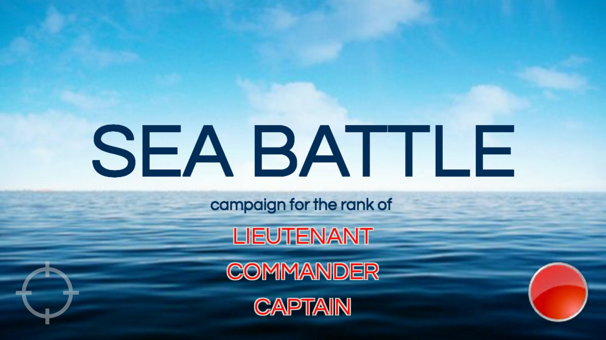

# SeaBattleAndroid

[GooglePlay Russian version](https://play.google.com/store/apps/details?id=com.avsappdevelopment.seabattleRU) 
[GooglePlay English version](https://play.google.com/store/apps/details?id=com.avsappdevelopment.seabattle) 
 
 

The times of soviet slot machines inspired us to create this application. 
This app is not a copy of slot machines interface and gameplay which were actually in '80 years of the previous century. 
This app is our modern vision of a simple torpedo attack sea battle game.

Destroy enemy warships!
You may share your results with friends!
Enjoy!

The gameplay is pretty simple. 
Use the onscreen joystick to move the aim point. 
Press and release the onscreen red button to shoot. 
Remember to get anticipate when shooting at a moving target. 
Torpedo needs 3 seconds for loading. 
There are 6 torpedoes per rank (per level). 
You may share your results with friends.

##Some screenshots:

